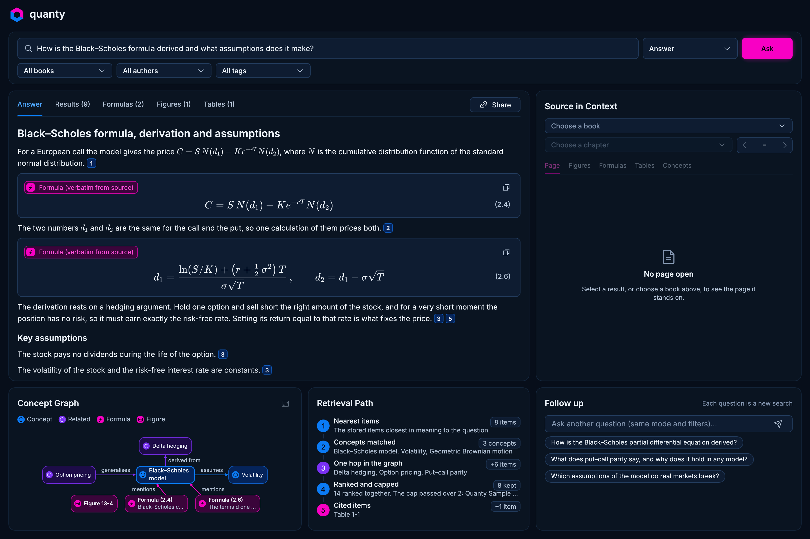

# quanty

## Initiative

On their own, LLMs cannot be trusted to automate post-trade analysis research: they hallucinate math and are not (yet) masters of quantitative trading end to end. A quant research team can instead give its agents a trusted knowledge base that it owns as its IP and moat.

quanty is an open-source answer. Give it PDFs of books and papers. Its OCR layer, run entirely by the software, uses Jev to find the math and Claude models to write it as LaTeX and describe each figure. Everything is embedded into a multimodal RAG database and linked by concept, so the connections grow with the knowledge base. It is 100% Rust, the UI included.

A person can ask it "what is the correct math for a multivariate Hawkes process and how has it been used to improve volatility forecasting?", and an agent can ask the same over MCP for a post-trade analytics or trading engine. The knowledge is not magically there: the business builds it. The point is that you know the math comes from data you gave. A next step is training datasets for a company's own LLMs, such as Gemma 4.

Whether the goal is maximising Sharpe ratio, increasing trade volume or reducing risk, quanty is a stepping stone between the robust modelling quant finance requires and the accelerating progress of QIS.

## See the app



*The desktop app on its built-in `black-scholes` fixture: sample data, no store, no model, no cost.*

With Rust installed and nothing else (no keys, no Docker), run this in the quanty folder, the root of this repository:

```bash
cargo run --release -p gui -- --fixture black-scholes
```

`--fixture list` names the other scenes. People use the [desktop app](#run-the-desktop-app), agents use the [MCP server](#mcp), and there is a [command line](#command-line). All three read the same stores, so [set up once](#set-up-once) first.

## Set up once

| You need | What it is for |
| --- | --- |
| Rust (stable, with `cargo`) | Builds every program |
| Docker, with `docker compose` | Runs the two stores: Qdrant (vectors) and FalkorDB (the graph) |
| [Poppler](https://poppler.freedesktop.org/) (`brew install poppler`) | Reads a PDF when a chapter is converted |
| The `claude` CLI, signed in | Reads pages, finds concepts and writes answers, on your `claude` subscription |
| `EMBEDDING_GEMINI_API_KEY` | Gemini embeddings: every ingest and every question |
| `CONVERTER_JEV_API_KEY` | The Jev API, which says whether a page holds math: only when a PDF is converted |

`ANTHROPIC_API_KEY` must **not** be set, in the shell or in `.env`. While it is set, quanty asks `claude` nothing, so that the work is billed to the subscription and not to the API.

Run every command in the quanty folder:

```bash
cp .env.example .env       # then put your two keys in place of PLEASE_PROVIDE and ENTER
unset ANTHROPIC_API_KEY    # does nothing when it is not set
docker compose up -d       # Qdrant on ports 6333 and 6334, FalkorDB on 6379, data under data/
cargo run --release -p rag-ingestion --bin rag-ingest -- health
```

`health` prints one line each for Qdrant, FalkorDB and `claude`: `ok`, or `FAILED` with what is wrong. It does not check the two keys or `ANTHROPIC_API_KEY`.

Then put a first chapter in and ask a question. One PDF is one chapter, named `chapter-<number>-<name>.pdf`. The repository holds a sample of seven pages:

```bash
cargo run --release -p rag-ingestion --bin rag-ingest -- pdf \
  --book "Option Volatility and Pricing" \
  --author "Sheldon Natenberg" --tag options \
  samples/chapter-1-sample-pages.pdf

cargo run --release -p rag-retrieval --bin rag-query -- "What is the Black–Scholes formula for a call option?"
```

The ingest is paid work: see [Costs](#costs). `--author` and `--tag` are optional. A 20-page chapter takes about 15 minutes. If it stops, run the same command again and it carries on. On a finished PDF it does nothing and costs nothing.

## Run the desktop app

```bash
cargo run --release -p gui    # builds and opens target/release/quanty
```

The window has three tabs:

- **Ask**: the question with its mode and its book, author and tag filters, the answer with its citations, the page each citation stands on, the concept graph, the steps of the search, and questions to ask next. The mode **Answer** costs one Gemini embedding call and one Sonnet call on your `claude` subscription. **Results only** writes no answer and costs the embedding call alone.
- **Library**: the stored books and their chapters, each with its pages, items, author and tags. **Copy id** copies the document id that `rag-ingest tag` and `rag-ingest delete-document` take, **Read** opens the chapter in Ask, and **Edit labels** corrects the author and the tags, as `rag-ingest tag` does, at no cost.
- **Ingest**: adds a chapter. Choose the PDF, choose the book or add a new one, check it, then start. The check is free. A start is paid work, the same as `rag-ingest pdf` above. Keep the app open while it runs; if it stops, start the same PDF again and it carries on. To keep a book in the list before it has a chapter, choose **Add a new book…**, type its title, author and tags, and press **Save book**.

| Key | What it does |
| --- | --- |
| `⌘1`, `⌘2`, `⌘3` | Go to Ask, Library, Ingest |
| `/` or `⌘K` | Write a question (`Enter` asks it) |
| `J`, `K` | Next and previous result |
| `⌘.` or `Esc` | Stop the search or the answer |
| `⇧⌘S` | Copy the answer with its citations |

The six panels of Ask and every key are in [docs/reference.md](docs/reference.md#the-desktop-app). When a store, a key or `claude` is not ready, the part of the window that needed it says which one and what to do.

Not built yet: the notices tray, the help sheet, the health check and the delete of a document. Delete one with `rag-ingest delete-document`.

## MCP

`quanty-mcp` is a [Model Context Protocol](https://modelcontextprotocol.io) server over the same stores. Build it and add it to Claude Code, with both lines run in the quanty folder. The server finds `.env`, `content/` and `data/` from the folder it starts in: that is what the `cd` is for.

```bash
cargo build --release -p mcp    # makes target/release/quanty-mcp
claude mcp add --scope user quanty -- sh -c "cd '$PWD' && exec '$PWD/target/release/quanty-mcp'"
```

| Tool | What it does | Cost |
| --- | --- | --- |
| `health` | Says whether Qdrant, FalkorDB and the `claude` sign-in are ready | Free |
| `list_documents` | Lists every stored document | Free |
| `search` | Finds the stored items nearest to a question | One small Gemini call |
| `read_page` | Reads one page of a chapter, in reading order | Free |
| `answer` | Writes an answer from what `search` finds, with its sources | A Gemini call and your `claude` subscription usage |
| `ingest_pdf` | Converts one chapter PDF and stores it | Paid and slow: `claude`, Jev and Gemini |
| `ingest_status` | Says how an ingest job is going | Free |

An agent that can write its own answer should call `search`, not `answer`. The arguments, the first calls to try, `.mcp.json`, HTTP and how to send a PDF are in [docs/mcp.md](docs/mcp.md).

## Command line

| Program | What it does | Run it as |
| --- | --- | --- |
| `rag-ingest` | Checks the services, ingests, labels and deletes documents | `cargo run --release -p rag-ingestion --bin rag-ingest -- …` |
| `rag-query` | Asks the stored items a question, and `--answer` writes an answer | `cargo run --release -p rag-retrieval --bin rag-query -- …` |
| `ocr` | Converts a chapter PDF into saved files under `content/`, and stores nothing | `cargo run --release -p ocr -- …` |

Every command and flag is in [docs/reference.md](docs/reference.md).

## Costs

| What | Billed to | When |
| --- | --- | --- |
| Gemini embeddings | Your Gemini API key, by the token | Every ingest and every question |
| Jev | Your Jev API key | The pages of a PDF, when they are converted |
| `claude` (Haiku and Sonnet) | The subscription `claude` is signed in to, never the API | Converting pages, finding concepts and writing an answer |

Converted pages and the answers about concepts are kept on disk, so a run that stopped goes on without paying twice, and a PDF that is already ingested costs nothing. `rag-ingest pdf` checks the Gemini key and both stores before the first page is paid for. These cost nothing: the two stores, which run on your machine, and `health`, `--fixture`, `list_documents`, `read_page`, `ingest_status`, `tag` and `delete-document`.

## Troubleshooting

| What you see | What to do |
| --- | --- |
| `could not reach Qdrant at …` or `could not connect to FalkorDB at …` | Run `docker compose up -d`, then `health` again |
| `did not answer like FalkorDB; another program may be using that port` | Something else listens on port 6379, such as a local Redis. Stop it, or map the container to another port and set `FALKORDB_URL` to match |
| `EMBEDDING_GEMINI_API_KEY is not set` or `CONVERTER_JEV_API_KEY is not set` | Put the key in `.env`, and start the command in the quanty folder: `.env` is looked for in the current folder and the folders above it |
| `ANTHROPIC_API_KEY is set, so claude could bill the API` or `claude is not signed in` | Run `unset ANTHROPIC_API_KEY`, or run `claude` in a terminal and sign in. Then start the program again |
| "The page was not found" in the app, or `no converted chapter under content has the document id …` from `read_page` | The chapter's folder is not where quanty looks. Put it inside a book folder under `content/`, or ingest its PDF again with `rag-ingest pdf` |

## Layout

Seven crates under `crates/`: `ocr`, `rag-core`, `graph`, `rag-ingestion`, `rag-retrieval`, `gui` and `mcp`. What each one is, and how a search works, is in [docs/reference.md](docs/reference.md#how-it-works). `samples/` holds the sample PDF and converted sample chapters. `content/` (converted chapters) and `data/` (the stores, the kept answers) are made on your machine and are not in git.

## Licence

MIT. See [LICENSE](LICENSE).
